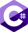

<picture>
  
</picture>

# C# Fundamentals - May 2022

Start Date: 16.05.2022

End Date: 07.08.2022

## About course 

С "Programming Fundamentals" студентите започват да изучават вътрешната програма на SoftUni за цялостна подготовка на софтуерни инженери. Курсът разглежда фундаментални концепции в програмирането, които са основа за ефективното и качествено обучение в професионалните модули. Обучаващите се надграждат знанията, придобити в курса Programming Basics и започват да използват по-сложни похвати и структури от програмирането като: масиви, листове, обекти и класове. Изучават се допълнителни технологии, необходими на всеки един софтуерен разработчик, като HTML и CSS, HTTP, побитови операции и други. Разглеждат се основите на web разработката, както и един от най-разпространените технологии и инструменти, с което курсът успешно изгражда представа у студентите относно предстоящите професионални модули и знанията, които ще придобият от тях, за да станат успешни софтуерни разработчици.

## Lectures 

[Basic Syntax, Conditional Statements and Loops (Lab) - 18.05.2022, lecturer Georgi Inkov](https://github.com/AntonBlagoev/CSharp-Fundamentals/tree/main/01.Intro-and-Basic-Syntax)

\- 01. Basic Syntax, Conditional Statements and Loops (Exercise) - 20.05.2022, lecturer Dimitar Krastanov(https://github.com/AntonBlagoev/CSharp-Fundamentals/tree/main/01.Intro-and-Basic-Syntax)

\- 01. Git and GitHub - 23.05.2022, lecturer Ivaylo Kenov

\- 02. Data Types and Variables (Lab) - 25.05.2022, lecturer Georgi Inkov

\- 02. Data Types and Variables (Exercise) - 27.05.2022, lecturer Dimitar Krastanov

\- 02. HTTP Basics - 30.05.2022, lecturer Ivaylo Kenov

\- 03. Arrays (Lab) - 01.06.2022, lecturer Georgi Inkov

\- 03. Arrays (Exercise) - 03.06.2022, lecturer Dimitar Krastanov

\- 03. HTML & CSS Basics - 07.06.2022, lecturer Ivaylo Kenov

\- 04. Methods (Lab) - 08.06.2022, lecturer Georgi Inkov

\- 04. Methods (Exercise) - 10.06.2022, lecturer Dimitar Krastanov

\- 04. Software Development Concepts - Part 1 - 13.06.2022, lecturer Ivaylo Kenov

\- 05. List (Lab) - 15.06.2022, lecturer Georgi Inkov

\- 05. List (Exercise) - 17.06.2022, lecturer Dimitar Krastanov

\- Exam Preparation - 20.06.2022, lecturer Georgi Inkov

\- Regular Mid Exam - 26.06.2022

\- 06. Objects and Classes (Lab) - 29.06.2022, lecturer Georgi Inkov

\- 06. Objects and Classes (Exercise) - 01.07.2022, lecturer Dimitar Krastanov

\- 06. Software Development Concepts - Part 2 - 04.07.2022, lecturer Ivaylo Kenov

\- 07. Associative Arrays (Lab) - 06.07.2022, lecturer Georgi Inkov

\- 07. Associative Arrays (Exercise) - 08.07.2022, lecturer Dimitar Krastanov

\- 07. Bitwise Operations - 12.07.2022, lecturer Ivaylo Kenov

\- 08. Text Processing (Lab) - 13.07.2022, lecturer Georgi Inkov

\- 08. Text Processing (Exercise) - 15.07.2022, lecturer Dimitar Krastanov

\- 08. Problem Solving - 19.07.2022, lecturer Ivaylo Kenov

\- 09. Regular Expressions (Lab) - 20.07.2022, lecturer Georgi Inkov

\- 09. Regular Expressions (Exercise) - 22.07.2022, lecturer Dimitar Krastanov

\- 09. Database Basics - 26.07.2022, lecturer Ivaylo Kenov

\- Exam Preparation - 27.07.2022, lecturer Dimitar Krastanov

\- Exam Preparation - 29.07.2022, lecturer Georgi Inkov

\- 09. QA Introduction - 01.08.2022, lecturer Dimo Mitev

\- 10. Basic Web Project - 03.08.2022, lecturer Georgi Inkov

\- Regular Final Exam - 07.08.2022

\- Retake Mid Exam - 11.08.2022

\- Retake Final Exam - 15.08.2022

## Links 

[SoftUni course page](https://softuni.bg/trainings/3729/programming-fundamentals-with-csharp-may-2022#lesson-40321)

[SoftUni Judge system](https://judge.softuni.org/Contests#!/List/ByCategory/149/CSharp-Fundamentals)

[Facebook group of course](https://www.facebook.com/groups/ProgrammingFundamentalswithCsharpMay2022)

[Discord group of course](https://discord.gg/9Grr4SDzsX)

[Paste Bin](https://pastebin.com/)

[regex101.com](https://regex101.com/)

[sli.do: #fund-csharp](https://app.sli.do/)

[GitHub: Georgi Inkov](https://github.com/GoShow)

[GitHub: Dimitar Krastanov](https://github.com/DraksBG?tab=repositories)

[GitHub: Ivaylo Kenov](https://github.com/ivaylokenov)

